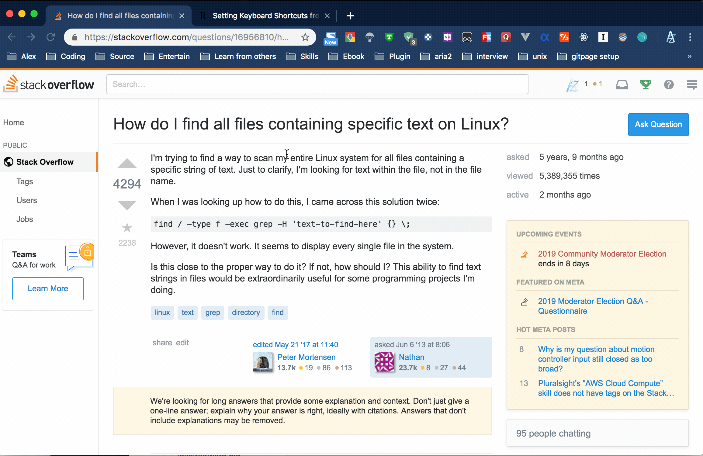

# Quick copy for markdown reference(auto attach title when copy url)
## Introduction
Copy the url & the title to make it for reference via Popclip quickly.Pattern like below<br />
```
[use custom domain with hexo && how to reset to origin](https://alexzl5.github.io/use-custom-domain-with-hexo/)
```



## Attention
XMLHttpRequest package required(as it's not distributed with Node).<br />
You could install it via following commands.
```
cd ~/Library/Application Support/PopClip/Extension/Markdown.popclipext
npm install xmlhttprequest
```

